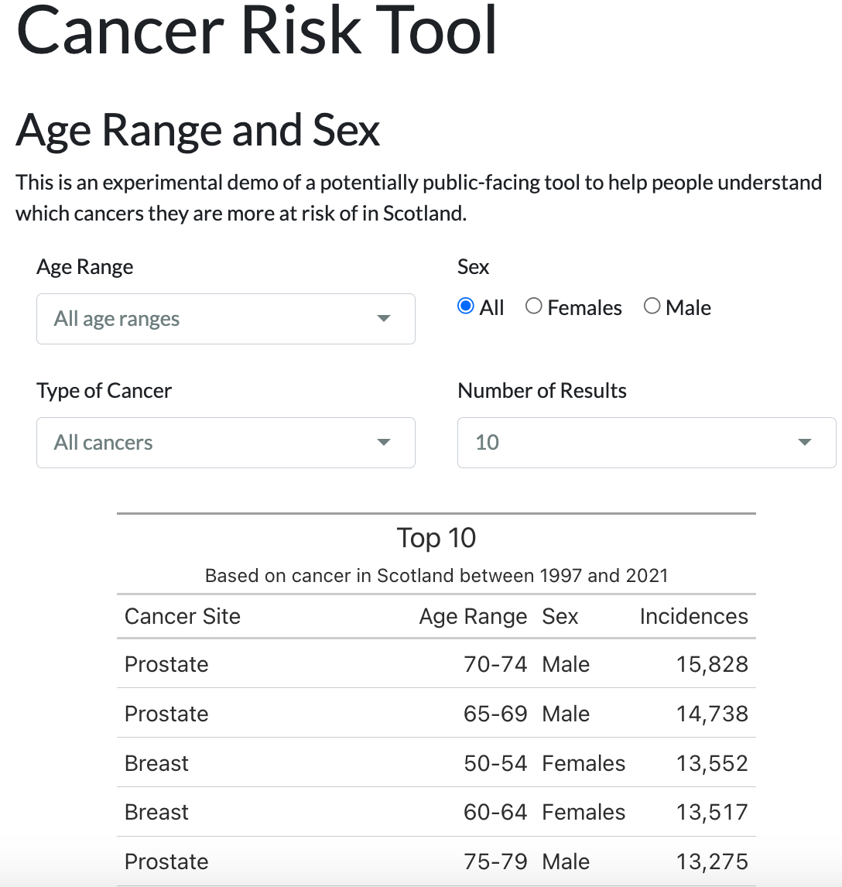

# Cancer in Scotland

Final individual project of CodeClan DR22 Professional Data Analysis Course.

For this a fictional brief was created to simulate a request from the Scottish 
Government to take a high-level look at cancer statistics in Scotland.

* **Project Brief**  
[documents/project_brief_cancer_in_scotland.pdf](documents/project_brief_cancer_in_scotland.pdf)

* **Analysis Report**  
The main analysis report combines 4 different analysis reports together in one 
larger document for convenience.
[analysis/0_analysis_report_cancer_in_scotland.html](analysis/0_analysis_report_cancer_in_scotland.html)

* **Cancer Risk Tool**  
One project output is a prototype of an interactive tool to let people try 
different combinations of Cancer type, age range and sex and see which cancers 
that combination is most at risk of according to over two decades of Scottish 
health data from 1997 and 2021 relating to cancer incidences.

The tool runs in R using R Studio.

To run the tool:

1. clone this project
2. in R Studio open the file `cancer_risk_tool/index.Rmd`
3. click "Run Document"
4. Choose an "Age Range", "Sex", "Type of Cancer" and a "Number of Results"
You should then see a table of how many incidences have been recorded.

Here's a screenshot of how it should look.

* **Data**   
All the data required to regenerate the analysis reports should be available if 
you clone this repository. Report data is in `data_clean`. If you need to recreate 
the project from scratch run the cleaning scripts in order in `cleaning_scripts`

This project contains data from:

* [National Records of Scotland](https://www.nrscotland.gov.uk/),  
© Crown Copyright 2023
* [Public Health Scotland](),  
Contains public sector information licensed 
under the [Open Government Licence v3.0](https://www.nationalarchives.gov.uk/doc/open-government-licence/version/3/).
